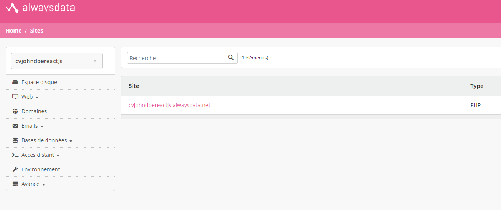

# DEVOIR CV EN LIGNE AVEC REACT.JS #

## INSTALLATION & COMMANDE ##


1:
```bash
git clone
```
2:
```bash
npm install
```

3:
```bash
npm run start
```

### W3C VALIDATOR ###

retrouver les screens des validateurs W3C dans src/w3c

! les erreurs au W3C en HTML sont les mêmes pour tous les fichier et sont dû a React.js et la syntaxe .jsx !
! Les fichiers CSS sont tous correct !


#### INFO HEBERGEMENT ####

Le site est censé être hébergé sur always data, or il fait plus de 100mo pour la version gratuite, il n'est donc pas hébergé. (voir screen)



